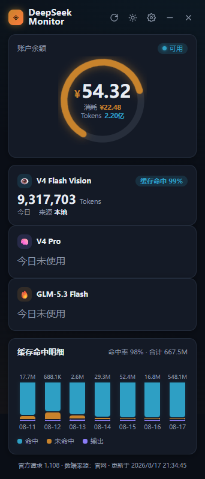

# DeepSeek Monitor 悬浮窗

一个 Windows 桌面悬浮小窗：启动 Claude Code / dsh 时自动弹出，实时显示 **DeepSeek 开放平台** 和 **智谱 GLM 平台** 的官方用量（余额、今日消费、模型 Tokens、请求数）和本地缓存命中统计。

数据以**官网为准**（Playwright 抓 `platform.deepseek.com/usage`），本地日志只做模型分解与 7 天图表，避免"本地统计 ≠ 官方"的偏差。**GLM 部分**官网只能提供余额与月消费（智谱官网无 per-model token 明细），token 用量走本地 jsonl。



> ⚠️ **定位说明**：这是**个人工作流工具，不是通用产品**——它深度绑定作者自己的环境。clone 前请先确认以下前提都满足，否则核心功能（官方数据）起不来：
>
> - **Windows 10+**（依赖系统 WebView2 运行时与已装的 Edge）
> - 使用 **Claude Code** 且会话日志落在 `~/.claude/projects/*/*.jsonl`（本地命中率/7 天图全靠它；不用 Claude Code 的话这些板块显示空）
> - 有 **DeepSeek 开放平台账号**，且愿意手动登录一次抓取会话（`node fetch_official.js --login`）
> - **（可选，显示 GLM 需）** 有 **智谱开放平台账号**，且愿意登录一次（`node fetch_glm.js --login`）
> - 本机可运行 **@playwright/test**（`npm install` 或全局安装）

## 创作缘由

DeepSeek V4 系列在 **2026-08-17 起大幅涨价**并改为峰谷定价——高峰时段费用直接翻倍，跑模型的成本一下子敏感起来。涨价之后，"得盯着点花费"就成了日常。但每次想看余额和用量，都得打开浏览器登录官方平台翻页面——重复几次就烦了。

后来又把 **智谱 GLM-5.3-Flash** 接入模型池（编码/agent 强、原生多模态、便宜），于是这个悬浮窗也一并把 **两个平台** 的余额和用量收进来，启动即见，随时知道钱花在哪儿。

## 功能

- 🪟 无边框置顶小窗，贴屏幕右上角，可拖拽
- 💰 官方余额 / 当日消耗 / 今日 Tokens（DeepSeek）
- 🔥 **智谱 GLM 余额** + 本月消费（GLM 卡片下方独立条）
- ⚡ **三模型卡片**：V4 Pro / V4 Flash Vision / GLM-5.3 Flash（DeepSeek 走官网，GLM 走本地 jsonl）
- 📊 最近 7 天缓存命中明细柱状图
- 🔄 手动刷新（每次约 8s，headless Edge 抓官网）
- 🎨 **深色「能源仪表舱」主题**（可切浅色）：深墨底 + 暖金弧环余额表 + 冷青缓存命中 + 等宽数字；标题栏主题按钮深浅切换并记忆（localStorage）
- 📀 **余额弧环**：余额外的 260° 弧环 = 今日消耗占预算比例（阈值来自 config 的 `today_cost_alert_threshold`），越阈值转红

## 环境要求

| 依赖 | 版本 | 说明 |
|------|------|------|
| Python | 3.10+ | `pip install -r requirements.txt`（pywebview） |
| Node.js | 18+ | 官网抓取器用 Playwright |
| Windows 10+ | — | pywebview 依赖系统 WebView2 运行时 |
| Microsoft Edge | 已装 | 抓取复用系统 Edge（`channel: msedge`） |

## 安装

```bash
# 1. Python 依赖
pip install -r requirements.txt

# 2. Node 依赖（官网抓取器）
npm install          # 安装 @playwright/test

# 3. 配置文件
cp config.example.json config.json
#    编辑 config.json，填入你的三条路径：
#    node_path         npm 全局 node_modules（@playwright/test 所在）
#    credentials_file  DeepSeek API key 文件
#    claude_projects   Claude Code 会话 jsonl 目录
```

## 首次登录

官网抓取需要平台登录会话，首次执行弹窗登录一次：

```bash
# DeepSeek 开放平台
node fetch_official.js --login   # 弹窗登录一次，会话存 .edge-profile/

# 智谱开放平台（仅当要显示 GLM 余额）
node fetch_glm.js --login        # 弹窗手机号+验证码登录一次，会话存 .glm-profile/
```

之后静默抓取：

```bash
node fetch_official.js   # 输出 DeepSeek 官方今日 JSON
node fetch_glm.js        # 输出智谱余额 + 月消费 JSON
```

## 启动

```bash
python launcher.py    # 触发入口：单实例、分离进程启动 app.py
python app.py         # 直接启动（debug 用）
```

## 自动触发

三种方式任选：

1. **Claude Code**：`settings.json` 加 SessionStart hook
   ```json
   { "matcher": "startup", "hooks": [{ "type": "command", "command": "python C:\\path\\to\\deepseek-monitor\\launcher.py", "async": true }] }
   ```
2. **dsh（手动脚本）**：在 `~/.dsh/scripts/start-dsh-web.ps1` 末尾加
   ```powershell
   Start-Process -FilePath 'python' -ArgumentList 'C:\path\to\deepseek-monitor\launcher.py' -WindowStyle Hidden
   ```
3. **dsh 桌面版**：`dsh-desktop/main.js` 的 `whenReady()` 里调 `launcher.py` 后重新打包（见该仓库）。

## 数据说明

- **DeepSeek 官方为准**：余额 / 今日消费 / Tokens / 请求数 / per-model 来自 `platform.deepseek.com/usage`（抓"今天"+"模型"视图）。官网 API 只有 `/user/balance`，没有用量端点，必须爬网页。
- **智谱 GLM**：官网 `open.bigmodel.cn/finance-center/finance/overview` 只能抓 **余额 + 本月总消费**（智谱财务页无 per-model token 明细，费用明细页"暂无数据"）。GLM 的 token 用量仍走本地 jsonl。
- **本地分解**：`data/parse_usage.py` 聚合 Claude Code 会话 jsonl，提供模型卡片的缓存命中率与 7 天图表。**不**再把缓存命中重读混进"用量"（缓存复用 98% 会把数字撑爆）。
- **费用折算**：`data/prices.py` 按消息时间戳分段计价。DeepSeek V4 2026-08-17 起改**峰谷定价**（高峰=北京 9-12、14-18 点），`prices.py` 已内置新旧两套价目并自动分段；GLM-5.3-Flash 为**智谱中国区固定价**（输入 0.8 / 输出 2.8 / 缓存 0.23 元，无峰谷）。
- 若官网抓不到（未登录/超时），余额回退 DeepSeek API（智谱无公开 API 则显示 "--"），其余字段如实显示 "--"，不编造。

## 目录结构

```
├── app.py               # pywebview 主窗口 + 本地数据服务(127.0.0.1:18773)
├── launcher.py          # 触发入口：单实例检查 + 分离启动 app.py
├── fetch_official.js    # DeepSeek 官网用量抓取器（Playwright + Edge profile）
├── fetch_glm.js         # 智谱 GLM 财务抓取器（余额 + 月消费，.glm-profile）
├── config.example.json  # 配置模板（复制为 config.json 后填写）
├── data/
│   ├── config.py        # 读取 config.json / 默认值
│   ├── prices.py        # DeepSeek 峰谷价目 + GLM 固定价 + 分段计价
│   ├── fetch_balance.py # DeepSeek /user/balance（API key 只读不落盘）
│   └── parse_usage.py   # jsonl 聚合 → 模型卡片 + 7 天图表
└── ui/                  # HTML/CSS/JS（深色能源仪表舱，可切浅色）
```

## 安全

- 🔑 DeepSeek API key 只从 `credentials_file` 内存读取，**不打印、不落盘、不进日志**
- 🍪 `.edge-profile/`（DeepSeek 登录会话）与 `.glm-profile/`（智谱登录会话）**已被 .gitignore 排除**，不会入库
- 默认配置基于 `~` 推导，config.json 里是你的个人路径——同样被 gitignore

## License

MIT
